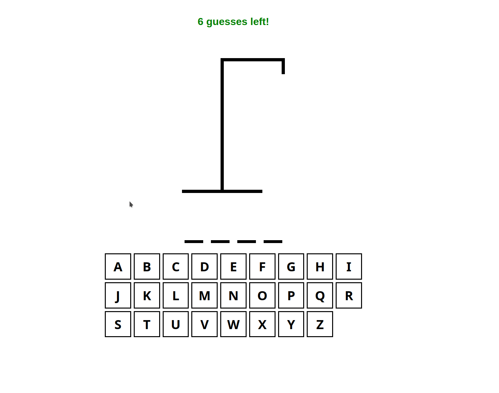

# Hangman

A small demo game created using React and Typescript.

Can you guess the secret word in the allotted number of guesses?

Based off of [https://youtu.be/-ONUyenGnWw](https://youtu.be/-ONUyenGnWw).

## Setup
1. Install [NodeJS](https://nodejs.org).

1. Install [Typescript](https://www.typescriptlang.org/).

1. Open a terminal and cd into the directory where you normally store your code/projects.

1. Clone this repository: `git clone git@gitlab.com:tradesmanhelix/hangman.git`

1. Install app depedencies: `npm install`

1. Run the app using `npm run dev` and navigate to indicated URL.

## Things to Note
- Extensive use of React hooks.
- Dynamic state passed as props to multiple components.
- Component props are Typescript types.

## Credits
Sound effects / audio used:
- [https://freesound.org/people/mglennsound/sounds/678667/](https://freesound.org/people/mglennsound/sounds/678667/)
- [https://freesound.org/people/xtrgamr/sounds/257780/](https://freesound.org/people/xtrgamr/sounds/257780/)
- [https://freesound.org/people/mehraniiii/sounds/588234/](https://freesound.org/people/mehraniiii/sounds/588234/)
- [https://freesound.org/people/MLaudio/sounds/511484/](https://freesound.org/people/MLaudio/sounds/511484/)

Rainbow CSS adapted from: [https://welearncode.com/rainbow-text/](https://welearncode.com/rainbow-text/).
